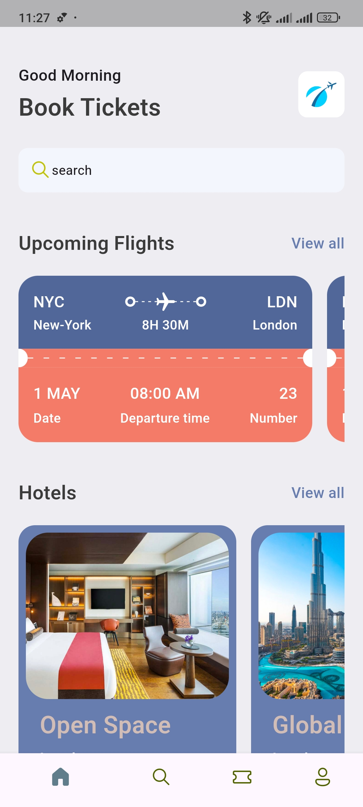
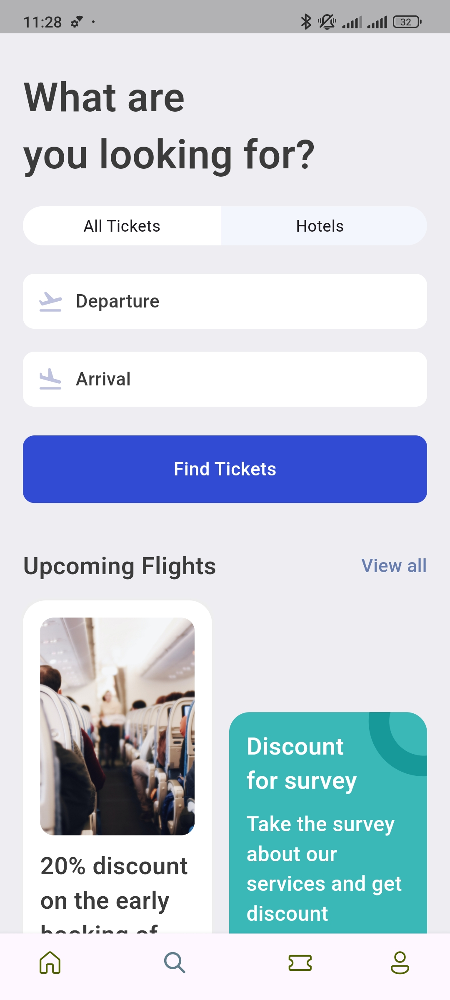
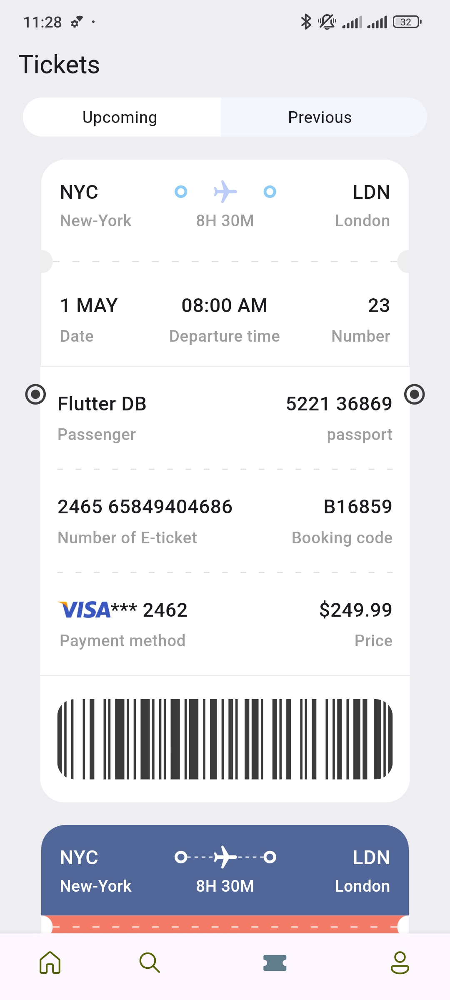
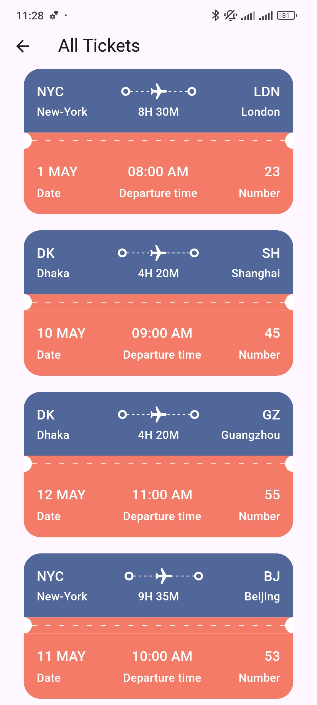

# Tickets App

## Overview
Tickets is a simple mobile app for flights and tickets. This app allows users to view ticket and flight details.

## Screen Snapshots

|Home Screen|Search Screen|
|-|-|
|||
|Ticket Details Screen|Tickets Screen|
|||


### App Features

- **Home Screen**:
  - Displays the main interface with options for navigating through the app.
  - Quick access to search for events, tickets, or information.
  
- **Search Screen**:
  - Users can search for tickets or events using various filters like date, location, and category.
  - Autocomplete suggestions help users find results faster.
  
- **Ticket Details Screen**:
  - Displays detailed information about selected tickets or events.
  - Includes pricing, date, time and availability.
  
- **Tickets Screen**:
  - Shows a list of all purchased tickets.
  - Tickets are organized with details like flight name, date, and seat information.

## Requirements

- ****Flutter 3.5 or higher****


## Getting Started


- ****1. Clone the repository:****
```

git clone https://github.com/OmarAhmed342/ticket_app.git

```

- ****2. Navigate to the project directory:****

```

cd ticket_app

```

- ****3. Clean and Install dependencies:****

```

flutter clean
flutter pub get

```

- ****4. Run the app:****

```

flutter run

```

  
## Technologies

Tickets is built using the following technologies:

  

- ****Flutter:**** Flutter is a popular mobile app development framework created by Google. It allows you to build high-performance, beautiful apps for iOS, Android, and the web.

- ****Dart:**** Dart is a programming language used for building Flutter apps. It is a modern, object-oriented language that is easy to learn and use.
